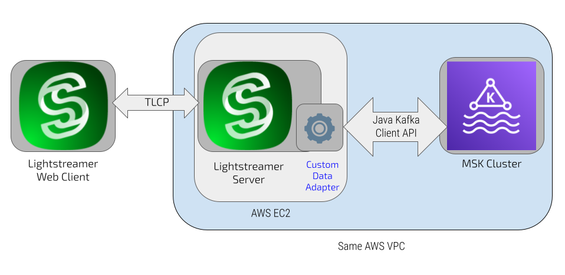

# Lightstreamer - Kafka Demo - Java Adapter

This project includes the resources needed to develop the Data Adapter for the Lightstreamer Airport Demo pluggable into Lightstreamer Server and leveraging the [Lightstreamer Kafka Connector](https://github.com/Lightstreamer/Lightstreamer-kafka-connector).

<br>

The Demo simulates a basic departures board with a few rows which represent information on flights departing from a hypothetical airport.<br>
The data are simulated with a random generator provided in this project and sent to a [Kafka](https://kafka.apache.org/) topic.

This project covers only the back-end side of the demo and in particular the configuration of the connector to be deployed into a Lightsreamer server and a random data generator for simulating the departures board information. For a client that displays this data, please refer to the section below: [Client to use with this demo](https://github.com/Lightstreamer/Lightstreamer-example-Kafka-adapter-java?tab=readme-ov-file#client-to-use-with-this-demo).

## Details

The source code of the projects is basically contained in the `producer` package, that implements the simulator of flight information and acts as the producer versus the Kafka cluster. In particular the following classes are defined:
- `DemoPublisher.java`, implementing the simulator generating and sending flight monitor data to a Kafka topic; the messages sent to Kafka will also have a key composed simply of a number representing the row in the table to which the information refers.
- `FlightInfo.java`, class that defines all the flight-related information to be displayed on the departure board, and will be serialized into JSON format as a Kafka message.

<br>

In the `resources` folder we found the configuration files needed to configure the Lightstreamer Kafka Connector:
- `adapters.xml`, in  this file, parameters are essentially configured for the connector to consume messages from Kafka, and the mapping between Kafka cluster topics and Lightstreamer items that the client will subscribe to is defined. In the specific case of this demo, message serialization occurs via JSON objects, and therefore, the mapping of fields from the received JSON object to the Lightstreamer item fields to be sent to clients is also defined. In particular, the section defining the field mapping is this one:
```xml
  <data_provider name="AirpotDemo">
    ...
    
    <!-- Extraction of the record key mapped to the field "key". -->
    <param name="field.key">#{KEY}</param>

    <!-- Extraction of the record value mapped to the field "value". -->
    <param name="field.destination">#{VALUE.destination}</param>
    <param name="field.departure">#{VALUE.departure}</param>
    <param name="field.flightNo">#{VALUE.flightNo}</param>
    <param name="field.terminal">#{VALUE.terminal}</param>
    <param name="field.status">#{VALUE.status}</param>
    <param name="field.airline">#{VALUE.airline}</param>
    <param name="field.currentTime">#{VALUE.currentTime}</param>

    ...
  </data_provider>
```
- `log4j.properties`, in this file, you'll find the specific configuration for the Lightstreamer Kafka Connector log, to obtain details about all interactions with the Kafka cluster and the message retrieval operations, along with their routing to the subscribed items in the Lightstreamer server. In this demo, a specific log file named `airport.log` is configured, destined for the same `logs` folder as the other Lightstreamer logs.

## Build and Install

To build and install your own version of the simulator you have two options: either use [Maven](https://maven.apache.org/) (or other build tools) to take care of dependencies and build (recommended) or gather the necessary jars yourself and build it manually.
For the sake of simplicity only the Maven case is detailed here.

### Maven

You can easily build the jar using Maven through the `pom.xml` file located in the root folder of this project. As an alternative, you can use any other alternative build tool (e.g. Gradle, Ivy, etc.).

Assuming Maven is installed and available in your path you can build the demo by running
```sh 
 $mvn install dependency:copy-dependencies 
```

If the task completes successfully it also creates a `target` folder, with the jar of the simulator and all the needed dependencies.

## Setting up the Demo

The demo needs a Kafka cluster where a topic with name `Flights` is created. You can use either a locally installed instance of Kafka in your environment, starting perhaps from the latest release of Apache Kafka as explained [here](https://kafka.apache.org/quickstart), or an installation of Confluent Platform (you can find a quickstart [here](https://docs.confluent.io/platform/current/platform-quickstart.html)). Alternatively, you can use one of the cloud services that offer fully managed services such as [Confluent Cloud](https://docs.confluent.io/cloud/current/get-started/index.html) or [AWS MSK](https://aws.amazon.com/msk/?nc2=type_a).
Based on this choice, you will need to modify the 'adapters.xml' files accordingly, particularly the 'bootstrap server' parameter. The proposed configuration assumes a local Kafka installation that does not require authentication or the use of TLS communication:
```xml
  <data_provider name="AirpotDemo">
        <adapter_class>com.lightstreamer.kafka_connector.adapters.KafkaConnectorDataAdapter</adapter_class>

        <!-- The Kafka cluster address -->
        <param name="bootstrap.servers">localhost:9092</param>

    ...

  </data_provider>
```
However, in more complex scenarios where authentication and TLS need to be set up, please refer to the Lightstreamer Kafka Connector guide [here](https://github.com/Lightstreamer/Lightstreamer-kafka-connector?tab=readme-ov-file#broker-authentication-parameters) and [here](https://github.com/Lightstreamer/Lightstreamer-kafka-connector?tab=readme-ov-file#encryption-parameters).

### Lightstreamer Server

 - Download Lightstreamer Server version 7.4.2 or later (Lightstreamer Server comes with a free non-expiring demo license for 20 connected users) from [Lightstreamer Download page](https://lightstreamer.com/download/), and install it, as explained in the GETTING_STARTED.TXT file in the installation home directory.
 - Make sure that Lightstreamer Server is not running.
 - Deploy a fresh installation of the Lightstreamer Kafka Connector following the instructions provided [here](https://github.com/Lightstreamer/Lightstreamer-kafka-connector?tab=readme-ov-file#deploy).
 - Replace the `adapters.xml` file with the one of this project and in the case update settings as discussed in the previous section.
 - [Optional] Customize the logging settings in log4j configuration file `log4j.properties`.
 - In order to avoid authentication stuff the machine running the Lightstreamer server must be in the same vpc of the MSK cluster.
 - Launch Lightstreamer Server.

### Simulator Producer loop

From the home of this project you can start the simulator producer loop with this command 

```sh 
  $mvn exec:java localhost:9092 Flights
```
 
Where *localhost:9092* is the bootstrap string for connecting to Kafka and for which the same considerations madea bove apply. `Flights` is the topic name used to produce the mesage with simulated flights info.

### Client to use with this demo

As a client for this demo you can use the [Lightstreamer - Airpot Demo - Web Client](https://github.com/Lightstreamer/Lightstreamer-example-AirportDemo-javascript); you can follow the instructions in the [Install section](https://github.com/Lightstreamer/Lightstreamer-example-AirportDemo-javascript?tab=readme-ov-file#install).

## See Also

* [Lightstreamer Kafka Connector](https://github.com/Lightstreamer/Lightstreamer-kafka-connector)

## Lightstreamer Compatibility Notes

- Compatible with Lightstreamer SDK for Java In-Process Adapters since 7.4.